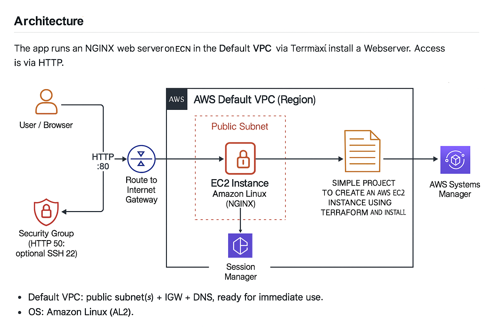

# Terraform_AWS_Projects

This repository contains AWS Terraform learning projects. The first project is:

- **01_Simple_EC2_With_NGINX** – Launches a single EC2 instance **in the Default VPC**, installs **NGINX** using cloud-init `user_data`, and serves a simple page:

  > *Simple Project to create AWS EC2 instance using Terraform and Install Webserver*

### What’s included
- **Terraform** only
- Best practices: provider pinning, SSM Session Manager (no SSH by default), least‑privilege SG (HTTP only), unified business tags (`X-Environment`, `X-Customer`, `X-Dept`, `X-Contact`).
- Robust **.gitignore** to prevent committing state, tfvars, keys/certs.

## Architecture

The app runs an **NGINX web server on EC2** in the **Default VPC** (public subnet). Access is via HTTP (80); administrative access uses **AWS Systems Manager Session Manager** (no inbound SSH).



**Notes**
- Default VPC: public subnet(s) + IGW + DNS, ready for immediate use.
- OS: Amazon Linux (AL2).
- Admin access: Session Manager (close port 22).


---
## Quick Start (Terraform)
```bash
cd 01_Simple_EC2_With_NGINX
cp example.tfvars terraform.tfvars   # edit region and X-* tags if needed
terraform init
terraform apply
open "$(terraform output -raw site_url)"
# cleanup
terraform destroy
```

## Aliases (optional)
Add to your `~/.zshrc`:
```bash
alias tf='terraform'
alias tfi='terraform init'
alias tfp='terraform plan'
alias tfa='terraform apply'
alias tfd='terraform destroy'
```